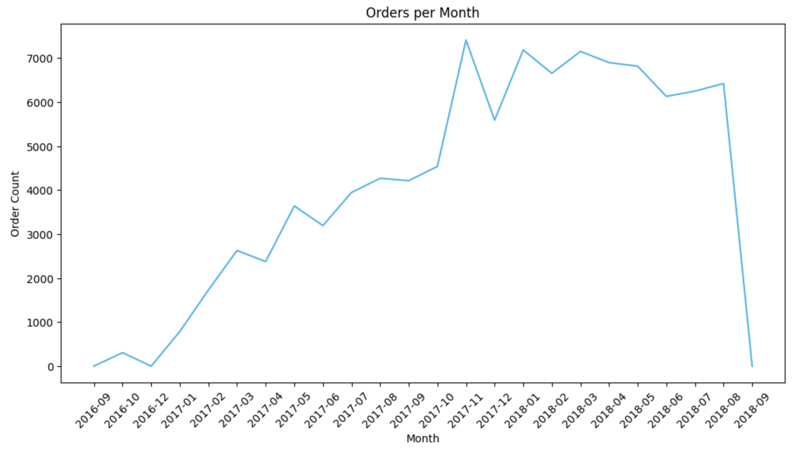
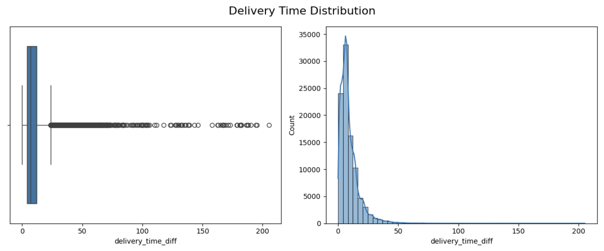
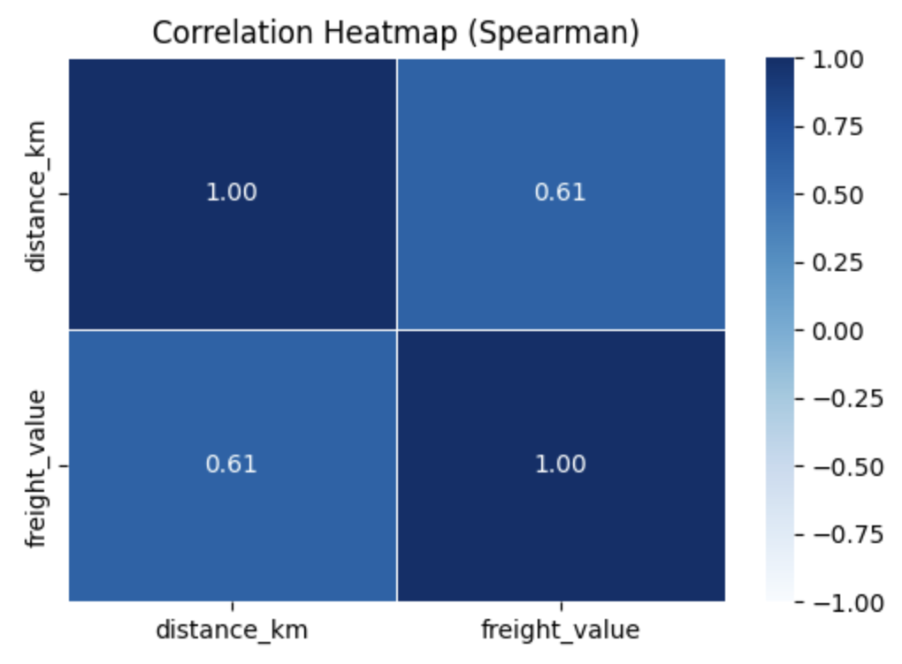
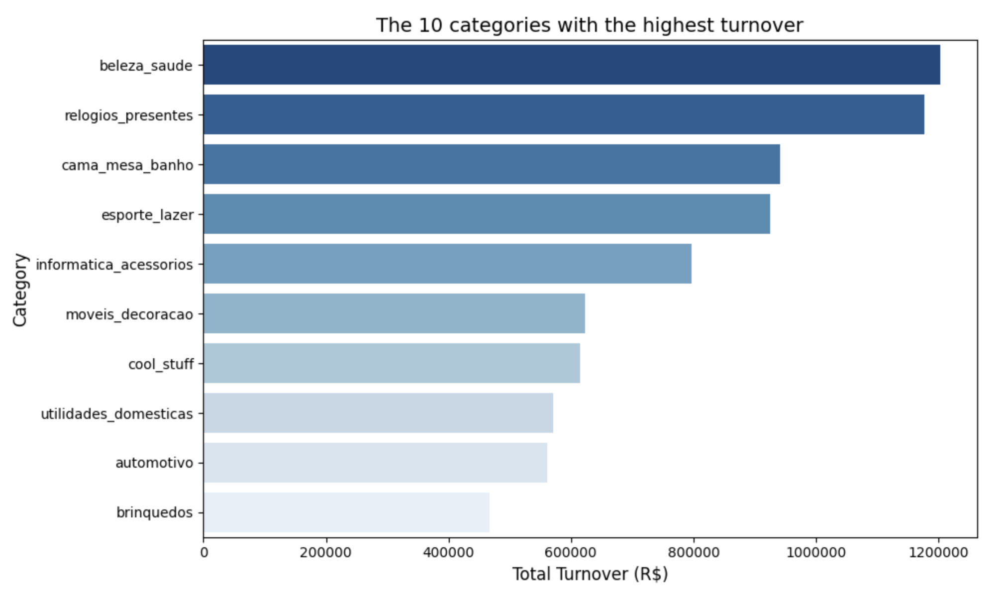
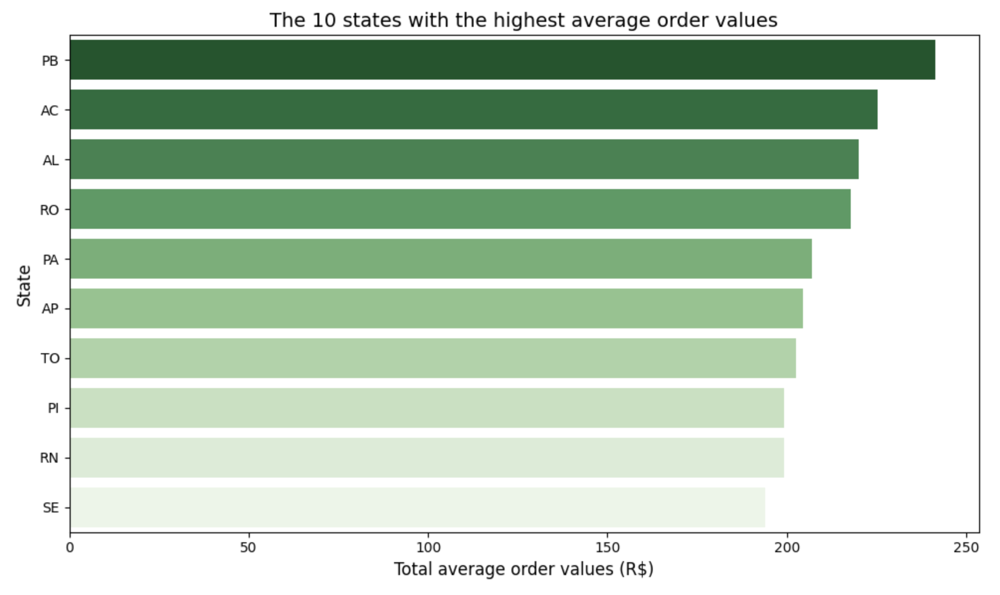

# Triggo.ai Technical Test 

## 🎯 Objectives
This repository contains notebooks and files used in a data analysis project focused on preparing, exploring and extracting business insights from a database obtained via the Kaggle API.

The guidelines for the technical test can be found [here](https://github.com/Triggo-ai4/desafio-data-engineer).

## 🎲 Database
To access the data, you need to set up access to the Kaggle API:

1. Go to your Kaggle profile > “Account” > “API” section > click on “Create New API Token”.

2. A file called kaggle.json will be downloaded automatically.

3. Save this file in a secure folder on your Google Drive.

4. At the beginning of the `triggo_ai_prep.ipynb` notebook, update the path with the correct location of your token.

For more details, see the official [Kaggle API documentation](https://www.kaggle.com/docs/api).

## 1. Data preparation

The steps of cleaning and transforming the datasets are described in this [Google Sheets](https://docs.google.com/spreadsheets/d/1nzsBwRFv1RVa1IVG4PNW-NKl76sO0iWDE-9pjh4RCOA/edit?usp=sharing) and were carried out in this notebook: `triggo_ai_prep.ipynb`.
At the end of the notebook, all the CSVs were integrated into a single file called `full_df.csv`.

## 2. Exploratory data analysis

The exploratory analysis was conducted in the `triggo_ai_eda.ipynb` notebook, with the aim of understanding the main characteristics of the data set and answering the questions requested.

### a) What is the volume of orders per month? Are there seasonal sales?

💡 There doesn't seem to be any seasonality, but in the two months of December shown in the data, there was a drop in orders compared to the previous month.

### b) What is the distribution of order delivery times?

💡 On average, deliveries were made in 9 days. Half of them could be delivered in up to 7 days.

### c) What is the relationship between freight costs and delivery distance?

💡 The correlation coefficient of 0.61 indicates a moderate positive relationship between delivery distance and freight price. In other words, as the distance increases, the value of the freight tends to increase as well.

### d) What are the best-selling product categories in terms of turnover?

💡 The “beauty_health” category leads the turnover ranking, totaling R$ 1,203,129.05 in the period analyzed. In second place is “watches_gifts”, followed by “bed_table_bathroom”.

### e) Which Brazilian states have the highest average order value?

💡 The state with the highest average ticket was Paraíba, with R$241.41, followed by Acre and Alagoas.

* States in the North/Northeast region tend to have higher average tickets.
* This may reflect the type of products consumed or the distance from the logistics centers.

## 3. Solving business problems
The analyses aimed at solving specific business problems are in the `triggo_ai_business.ipynb` notebook.

### 3.1 Retention Analysis
*   **Recurring customer**: customer_unique_id with more than one order in the period analyzed.

$$
\text{Retention rate} = \frac{\text{Recurring customer}}{\text{Total customers}}
$$

💡 The low rate of customer recurrence (3%) may indicate the need:
* to look at the product / service offered
* a loyalty program

### 3.2 Delay Prediction
* **Delivery delay**: delivery date longer than the estimated date.

### 3.3 Customer Segmentation
### 3.4 Satisfaction Analysis

## 🛠️ Technologies used

## 👩🏻‍💻 Author

## 🔓 License

