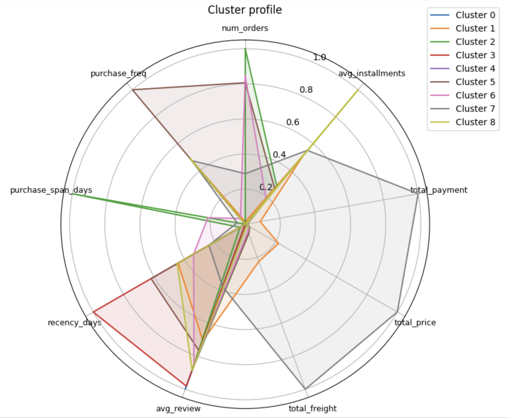
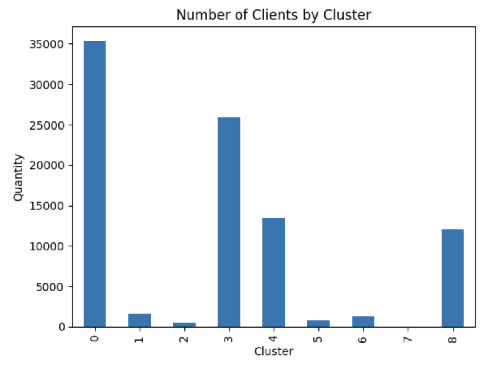
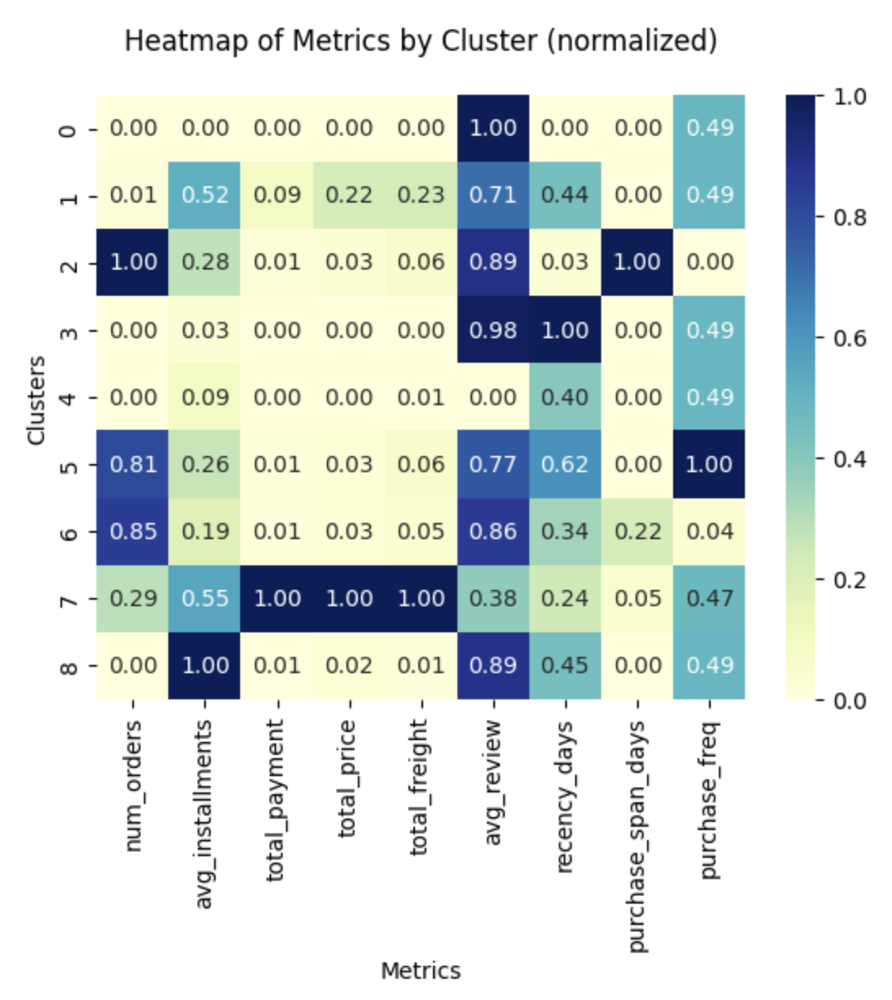
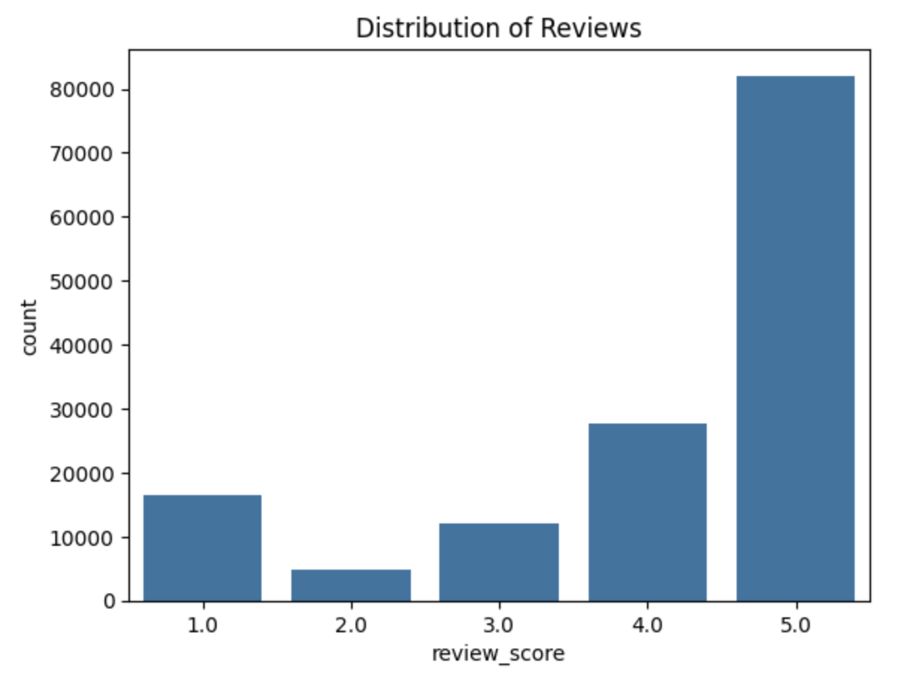
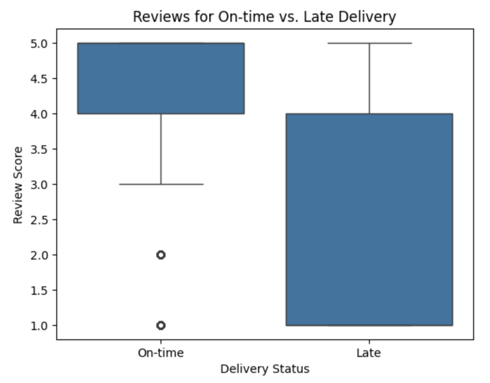
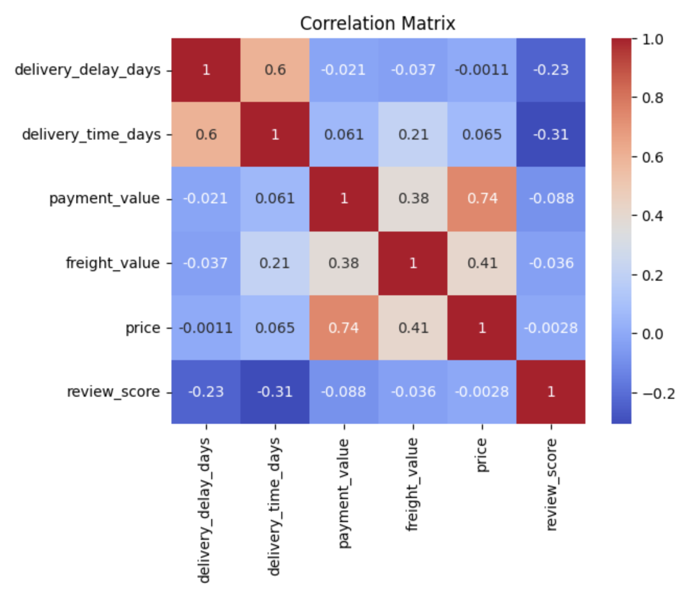

# Triggo.ai Technical Test 

## 🎯 Objectives
This repository contains notebooks and files used in a data analysis project focused on preparing, exploring and extracting business insights from a database obtained via the Kaggle API.

The guidelines for the technical test can be found [here](https://github.com/Triggo-ai4/desafio-data-engineer) and the datasets used are on [Kaggle](https://www.kaggle.com/datasets/olistbr/brazilian-ecommerce).

## 🎲 Database
To access the data, you need to set up access to the Kaggle API:

1. Go to your Kaggle profile > “Account” > “API” section > click on “Create New API Token”.

2. A file called kaggle.json will be downloaded automatically.

3. Save this file in a secure folder on your Google Drive.

4. At the beginning of the `triggo_ai_prep.ipynb` notebook, update the path with the correct location of your token.

For more details, see the official [Kaggle API documentation](https://www.kaggle.com/docs/api).

## 1. Data preparation

The steps of cleaning and transforming the datasets are described in this [Google Sheets](https://docs.google.com/spreadsheets/d/1nzsBwRFv1RVa1IVG4PNW-NKl76sO0iWDE-9pjh4RCOA/edit?usp=sharing) and were carried out in this notebook: `triggo_ai_prep.ipynb`.
At the end of the notebook, all the CSVs were integrated into a single file called `full_df.csv`.

## 2. Exploratory data analysis

The exploratory analysis was conducted in the `triggo_ai_eda.ipynb` notebook, with the aim of understanding the main characteristics of the data set and answering the questions requested.

### a) What is the volume of orders per month? Are there seasonal sales?

💡 There doesn't seem to be any seasonality, but in the two months of December shown in the data, there was a drop in orders compared to the previous month.

### b) What is the distribution of order delivery times?

💡 On average, deliveries were made in 9 days. Half of them could be delivered in up to 7 days.

### c) What is the relationship between freight costs and delivery distance?

💡 The correlation coefficient of 0.61 indicates a moderate positive relationship between delivery distance and freight price. In other words, as the distance increases, the value of the freight tends to increase as well.

### d) What are the best-selling product categories in terms of turnover?

💡 The “beauty_health” category leads the turnover ranking, totaling R$ 1,203,129.05 in the period analyzed. In second place is “watches_gifts”, followed by “bed_table_bathroom”.

### e) Which Brazilian states have the highest average order value?

💡 The state with the highest average ticket was Paraíba, with R$241.41, followed by Acre and Alagoas.

* States in the North/Northeast region tend to have higher average tickets.
* This may reflect the type of products consumed or the distance from the logistics centers.

## 3. Solving business problems
The analyses aimed at solving specific business problems are in the `triggo_ai_business.ipynb` notebook.

### 3.1 Retention Analysis
*   **Recurring customer**: customer_unique_id with more than one order in the period analyzed.

$$
\text{Retention rate} = \frac{\text{Recurring customer}}{\text{Total customers}}
$$

💡 The low rate of customer recurrence (3%) may indicate the need:
* to look at the product / service offered
* a loyalty program

### 3.2 Delay Prediction
* **Delivery delay**: delivery date longer than the estimated date.

**DecisionTreeClassifier:**
|| precision | recall | f1-score | support |
|-:|-:|-:|-:|-:|
| 0 | 0.92 | 1.00 | 0.96 | 39574 |
| 1 | 0.55 | 0.00 | 0.00 | 3371  |
||||||
| accuracy ||| 0.92 | 42945 |
| macro avg | 0.73 | 0.50 | 0.48 | 42945 |
| weighted avg | 0.89 | 0.92 | 0.88 | 42945 |

As the data is unbalanced, the classification model has learned to predict only the majority class (class 0, i.e. no delivery delay).

Class 0 (no delay):
* Precision: 0.92 → When the model says that delivery won't be delayed, it's right 92% of the time.
* Recall: 1.00 → The model finds 100% of delivery cases without delay.
* F1-score: 0.96 → Good balance between precision and recall.

Class 1 (with delay):
* Precision: 0.55 → Not good because is misleading as the base is unbalanced.

* Recall: 0.00 → The model hasn't identified any cases of delay.

* F1-score: 0.00 → The model is failing completely in class 1.

Overall accuracy: 92%
* Looks good, but is misleading because the vast majority of data is class 0 (no delay).

Macro avg:
* Takes both classes into account equally, even if they are unbalanced.

* Average recall: 0.50 → The model only hits one of the two classes.

### 3.3 Customer Segmentation

**Cluster 0:** Single purchase, low average ticket (\~R\$124), short installments (~2x), great rating (4.69) and recent. Punctual and satisfied customer profile.

**Cluster 1:** High-value buyer: very high average ticket (\~R\$1,785), high installments (\~5x), high shipping (\~R\$201) and moderate rating (3.81). More frequent purchases, but almost recurring. High-spending customer profile and reasonable frequency.

**Cluster 2:** Recurring, with an average of 2.3 orders, moderate values (\~R\$360), installments of \~3.6x, and a good rating (4.37). However, long time between purchases and low frequency (0.008). Profile of a customer who has bought more than once, but very sporadically.

**Cluster 3:** Single purchase, low value (\~R\$128), few installments (2x), excellent rating (4.64), but last purchase very old (recency of \~395 days). Satisfied but inactive customer profile.

**Cluster 4:** Single purchase and poorly rated: average ticket \~R\$152, low rating (1.67), few installments (\~2.4x), and high recency. Profile of a customer who bought once, didn't like it and never returned.

**Cluster 5:** Recurring customer, with 2 purchases on average, average total value (\~R\$322), reasonable rating (3.99), and high frequency (\~2). Engaged and active customer profile.

**Cluster 6:** Buyer with two purchases, similar values to cluster 5 (~$325), good evaluation (4.26), but long interval between purchases (span ~62 days) and low frequency. Potentially loyal customer profile, but with a slow pace.

**Cluster 7:** Premium customer: very high ticket (\~\$7,699), high installments (5x), very high shipping (\~\$804), but low rating (2.81). Few purchases (\~1.37), spaced out, but recent. High-value customer profile with low satisfaction.

**Cluster 8:** Single purchase, many installments (8x), average value (\~R\$306), good rating (4.35), and recent purchase. Profile of a new customer with potential, as they made a reasonable purchase and left satisfied.

### 3.4 Satisfaction Analysis

* Most of the ratings vary between 4 and 5 points.
* Orders that had a delay in delivery received lower reviews on average than those that arrived on time.
* Comparing the distributions of late deliveries (or not) with the reviews, the orders delivered without delay have some low reviews while the orders with delays had 75% of the reviews up to 4 points.
* The categories with the best scores are:
    1. fashion_roupa_infanto_juvenil
    2. cds_dvds_musicais
    3. livros_importados
    4. livros_interesse_geral
    5. portateis_casa_forno_e_cafe
* The number of delivery days since the date of purchase has the greatest impact on the review score - correlation of -0.31.

## 🛠️ Technologies used

## 👩🏻‍💻 Author

## 🔓 License

